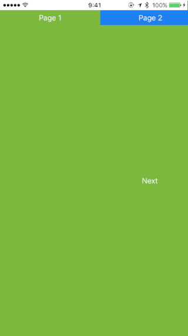

# PageMenu

View controller container which provides the paged views with menus.

## Requirements

- iOS 8.0 or later

## License

PageMenu is released under the MIT license.  
For more information, see LICENSE file in this repository.
